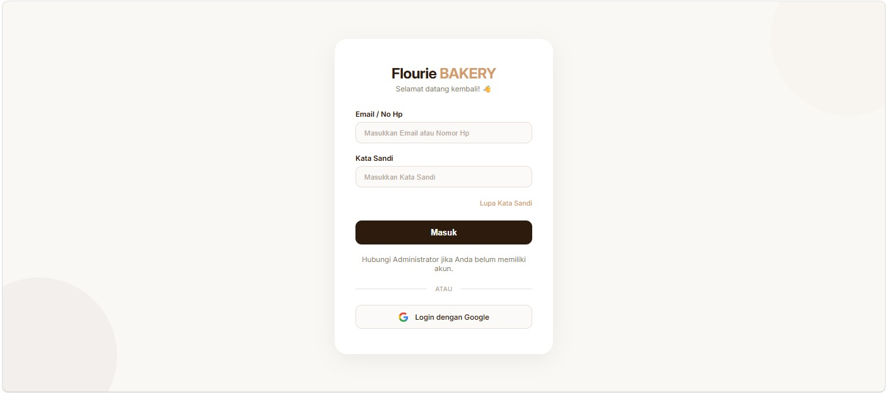
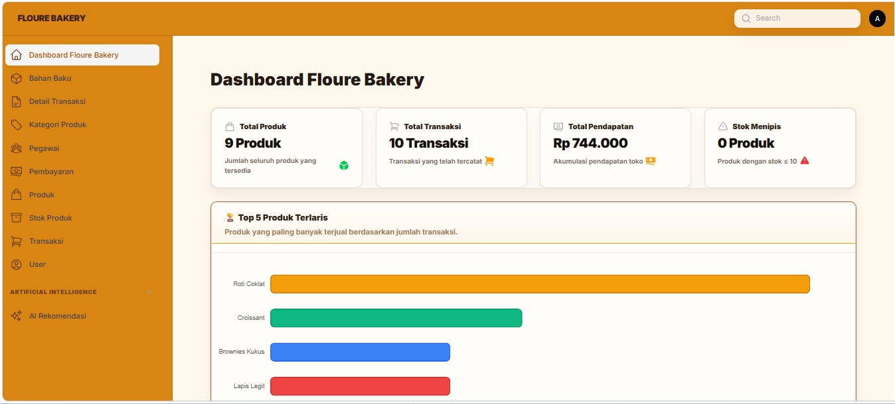
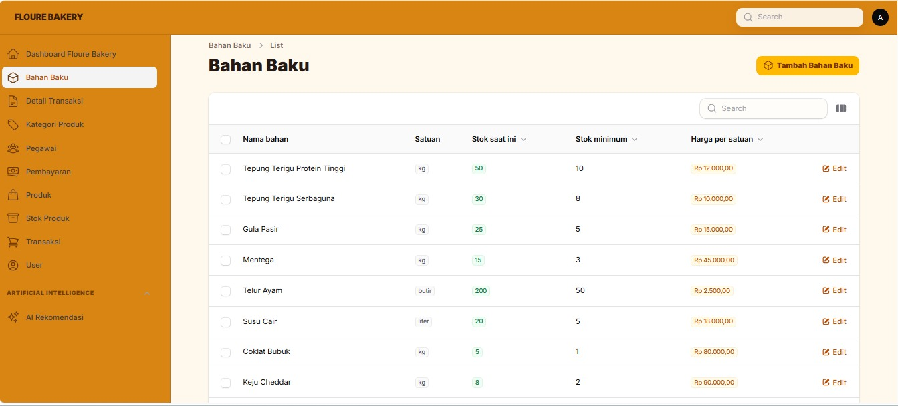
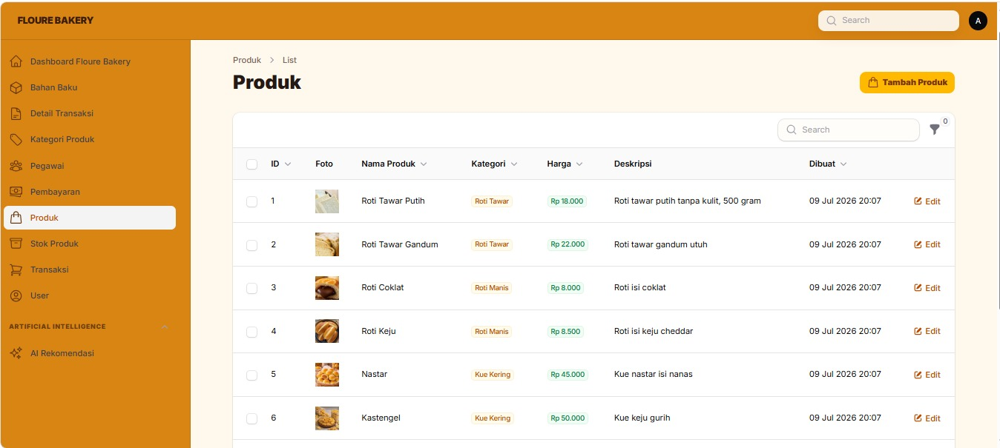
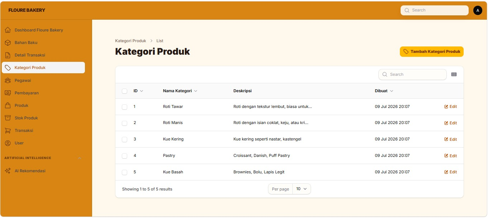
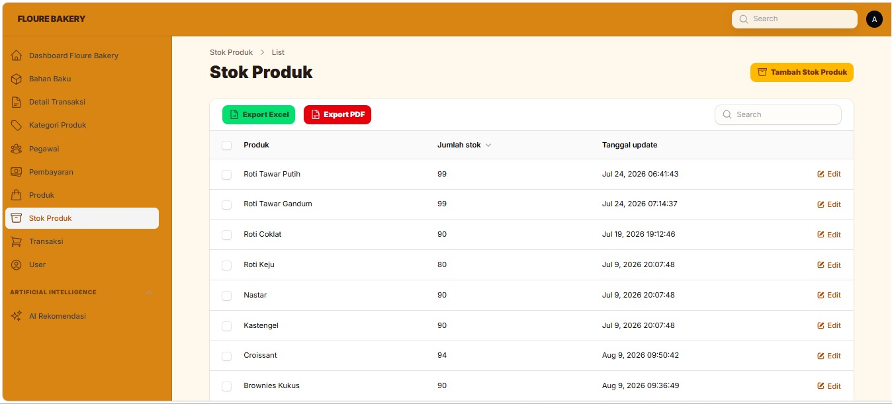
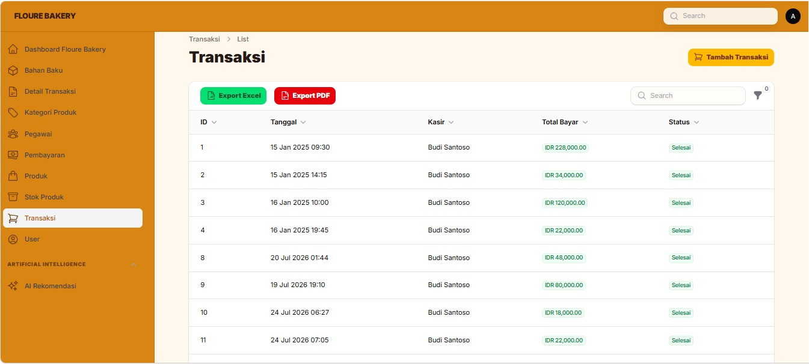
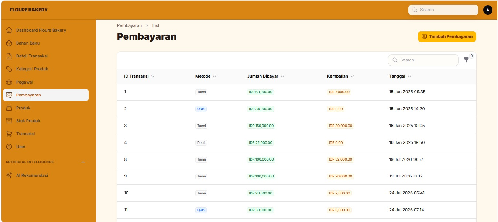
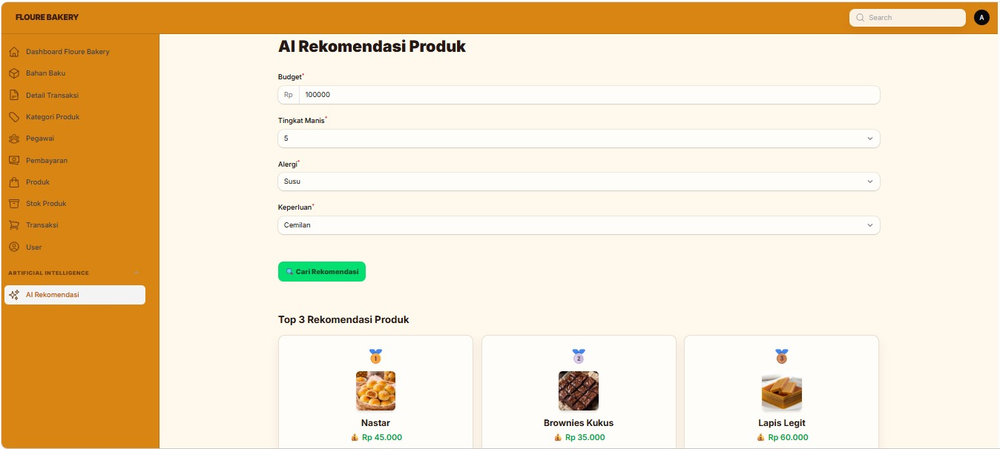

# 🍞 Sistem Informasi Manajemen Toko Roti

Sistem Informasi Manajemen Toko Roti berbasis web yang dibangun menggunakan Laravel dan MySQL. Aplikasi ini dirancang untuk membantu proses pengelolaan produk, stok, bahan baku, pegawai, transaksi penjualan, pembayaran, serta menyediakan fitur berbasis Artificial Intelligence (AI) untuk membantu memberikan informasi dan rekomendasi terkait produk.

---

## 📋 Deskripsi Aplikasi

Sistem Informasi Manajemen Toko Roti merupakan aplikasi berbasis web yang dikembangkan untuk membantu proses pengelolaan operasional toko roti secara lebih terstruktur, cepat, dan efisien.

Aplikasi ini dibuat untuk menggantikan proses pencatatan dan pengelolaan data secara manual yang dapat menimbulkan berbagai permasalahan, seperti kesalahan pencatatan, kesulitan dalam melakukan pencarian data, serta kurang efektifnya proses pemantauan stok dan transaksi.

Melalui sistem ini, pengguna dapat melakukan pengelolaan berbagai data utama toko roti, mulai dari data kategori produk, produk, stok produk, bahan baku, pegawai, hingga transaksi penjualan dan pembayaran.

Sistem juga menerapkan autentikasi dan hak akses pengguna sehingga pengguna dapat mengakses fitur sesuai dengan role yang dimilikinya. Pada sistem ini terdapat role Admin dan Kasir dengan hak akses yang berbeda.

Selain fungsi manajemen data, aplikasi dilengkapi dengan fitur AI pada data produk. Fitur tersebut memanfaatkan informasi produk seperti tingkat kemanisan, alergi, keperluan, dan informasi lainnya untuk membantu memberikan hasil rekomendasi yang lebih sesuai dengan kebutuhan pengguna.

Aplikasi dikembangkan menggunakan framework Laravel dengan MySQL sebagai database. Sistem dapat dijalankan pada lingkungan pengembangan lokal seperti Laragon maupun web server lain yang mendukung PHP dan MySQL.

Dengan adanya sistem ini, proses pengelolaan toko roti diharapkan menjadi lebih terorganisir serta dapat membantu pengguna dalam melakukan pencatatan, pemantauan stok, pengelolaan transaksi, dan memperoleh informasi produk secara lebih mudah.

---

## ✨ Fitur Aplikasi

🔐 Autentikasi dan Pengguna
1. Login pengguna
2. Logout
3. Autentikasi menggunakan email dan password
4. Login menggunakan Google
5. Manajemen role pengguna
6. Role Admin dan Kasir
7. Pembatasan akses berdasarkan role

👨‍💼 Manajemen Pegawai
8. Menampilkan data pegawai
9. Menambah data pegawai
10. Mengubah data pegawai
11. Menghapus data pegawai
12. Mengelola jabatan Admin dan Kasir

🏷️ Manajemen Kategori Produk
13. Menampilkan kategori produk
14. Menambah kategori produk
15. Mengubah kategori produk
16. Menghapus kategori produk
17. Menampilkan deskripsi kategori

🍞 Manajemen Produk
18. Menampilkan daftar produk
19. Menambah produk
20. Mengubah produk
21. Menghapus produk
22. Mengelola harga jual
23. Mengelola deskripsi produk
24. Mengelola gambar produk
25. Mengelola tingkat kemanisan produk
26. Mengelola informasi alergi
27. Mengelola keperluan produk

🤖 Fitur Artificial Intelligence
28. Memberikan rekomendasi produk berdasarkan informasi produk
29. Memanfaatkan atribut produk sebagai dasar rekomendasi
30. Mempertimbangkan tingkat kemanisan
31. Mempertimbangkan informasi alergi
32. Mempertimbangkan keperluan pengguna
33. Menampilkan hasil rekomendasi produk melalui sistem

📦 Manajemen Stok
34. Menampilkan stok produk
35. Menambah dan memperbarui jumlah stok
36. Memantau ketersediaan produk
37. Memperbarui tanggal perubahan stok

🧂 Manajemen Bahan Baku
38. Menampilkan bahan baku
39. Menambah bahan baku
40. Mengubah bahan baku
41. Menghapus bahan baku
42. Menampilkan jumlah stok bahan baku
43. Menentukan stok minimum
44. Menampilkan harga per satuan bahan baku

🛒 Transaksi Penjualan
45. Membuat transaksi penjualan
46. Menambahkan produk ke transaksi
47. Mengatur jumlah produk yang dibeli
48. Menghitung subtotal transaksi
49. Menghitung total pembayaran
50. Mengelola status transaksi

💳 Pembayaran
51. Mencatat pembayaran transaksi
52. Mendukung pembayaran Tunai
53. Mendukung pembayaran QRIS
54. Mendukung pembayaran Debit
55. Mendukung pembayaran Transfer
56. Menghitung jumlah kembalian

📊 Dashboard
57. Menampilkan informasi ringkasan sistem
58. Menampilkan informasi produk
59. Menampilkan informasi stok
60. Menampilkan informasi transaksi

---

## 🚀 Cara Menjalankan Aplikasi

### Prasyarat
- PHP >= 8.3
- Composer
- MySQL / MariaDB
- Laravel
- Node.js & NPM
- Laragon atau web server lain
- Git (opsional, jika melakukan clone repository)

### Langkah Instalasi

1. **Clone atau download** repository ini ke folder web kerja:
   ```
   git clone <URL_REPOSITORY>
   ```

2. **Install Dependency Laravel**
   ```Jalankan:
   composer install
   ```
   ```
   Kemudian install dependency frontend:
   npm install
   ```

3. **Konfigurasi File .env** — Salin file .env.example menjadi .env:
   ```
   cp .env.example .env
   ```
   Kemudian generate application key:
   ```
   php artisan key:generate
   ```

4. **Konfigurasi Database** — Buat database MySQL dengan nama:
   ```
   toko_roti
   ```
   Kemudian sesuaikan konfigurasi pada file .env:
   ```
    DB_CONNECTION=mysql
    DB_HOST=127.0.0.1
    DB_PORT=3306
    DB_DATABASE=toko_roti
    DB_USERNAME=root
    DB_PASSWORD=
   ```

5. **Jalankan Migration** Untuk membuat seluruh struktur tabel database dari awal:
   ```
   php artisan migrate:fresh --seed
   ```
   Seeder akan mengisi beberapa data awal seperti:

    - User Admin
    - User Kasir
    - Pegawai
    - Kategori Produk
    - Produk
    - Stok Produk
    - Bahan Baku

6. **Menjalankan Frontend** Jalankan:
   ```
   npm run dev
   ```
   Kemudian pada terminal lain jalankan server Laravel:
   ```
   php artisan serve
   ```

---

## 🗄️ Struktur Database

Database: `toko_roti`

| Tabel              | Deskripsi                                |
| ------------------ | ---------------------------------------- |
| `users`            | Menyimpan akun pengguna dan role         |
| `pegawai`          | Menyimpan data pegawai toko              |
| `kategori_produk`  | Menyimpan kategori produk                |
| `produk`           | Menyimpan data produk toko roti          |
| `stok_produk`      | Menyimpan jumlah stok setiap produk      |
| `bahan_baku`       | Menyimpan data bahan baku                |
| `transaksi`        | Menyimpan data transaksi penjualan       |
| `detail_transaksi` | Menyimpan detail produk dalam transaksi  |
| `pembayaran`       | Menyimpan informasi pembayaran transaksi |


### Relasi Database

```
Struktur Pohon Relasi:


users
  │
  └── pengguna / autentikasi


pegawai
  │
  └── transaksi
        │
        ├── detail_transaksi
        │       │
        │       └── produk
        │              │
        │              ├── kategori_produk
        │              │
        │              └── stok_produk
        │
        └── pembayaran


bahan_baku


Tabel Relasi:
| Tabel Asal        | Tabel Tujuan       | Relasi                     |
| ----------------- | ------------------ | -------------------------- |
| `kategori_produk` | `produk`           | One to Many                |
| `produk`          | `stok_produk`      | One to One                 |
| `pegawai`         | `transaksi`        | One to Many                |
| `transaksi`       | `detail_transaksi` | One to Many                |
| `produk`          | `detail_transaksi` | One to Many                |
| `transaksi`       | `pembayaran`       | One to One                 |
| `users`           | sistem autentikasi | One to Many / pengguna     |
| `produk`          | fitur AI           | sumber atribut rekomendasi |

```

## 🤖 Fitur Artificial Intelligence

Salah satu fitur utama yang membedakan aplikasi ini adalah penerapan Artificial Intelligence pada rekomendasi produk.

Data produk tidak hanya menyimpan nama dan harga, tetapi juga memiliki beberapa atribut yang dapat digunakan sebagai informasi untuk memberikan rekomendasi, seperti:
```
nama_produk
harga_jual
tingkat_manis
alergi
keperluan
deskripsi
```
Atribut tersebut digunakan sebagai informasi yang membantu sistem menentukan produk yang lebih sesuai dengan kebutuhan pengguna.

Contohnya, pengguna dapat memiliki kebutuhan seperti:
```
Tingkat kemanisan : rendah
Alergi             : susu
Keperluan          : sarapan
```
Kemudian sistem akan membandingkan kebutuhan tersebut dengan karakteristik produk yang tersedia dan memberikan rekomendasi produk yang dianggap paling sesuai.

---

## 📸 Screenshot Tampilan Aplikasi

> screenshot tampilan aplikasi setelah berjalan.

**Halaman Login**


**Dashboard**


**Bahan Baku**


**Data Produk**


**Data Kategori**


**Data Stok**


**Data Transaksi**


**Data Pembayaran**


**AI Recomendation**


---

## 🛠️ Teknologi

- **Framework**: Laravel 13
- **Backend**: PHP
- **Database**: MySQL
- **Frontend**: Blade, HTML, CSS, JavaScript
- **Styling**: Tailwind CSS / komponen frontend yang digunakan dalam project
- **Package Management**: Composer & NPM
- **Authentication**: Laravel Authentication & Google Authentication
- **AI**: Artificial Intelligence untuk rekomendasi produk
- **Web Server**: Laragon
- **Version Control**: Git & GitHub

---

## 📁 Struktur Project
Secara umum struktur project Laravel:
```
toko-roti/
│
├── app/
│   ├── Models/
│   ├── Http/
│   └── Providers/
│
├── database/
│   ├── migrations/
│   └── seeders/
│
├── resources/
│   ├── views/
│   ├── css/
│   └── js/
│
├── routes/
│   ├── web.php
│   └── api.php
│
├── public/
│
├── storage/
│
├── .env.example
├── artisan
├── composer.json
├── package.json
└── README.md
```

---

## 📝 Catatan
Project ini dikembangkan sebagai bagian dari tugas/proyek akademik dengan studi kasus Sistem Informasi Manajemen Toko Roti.

Fokus utama sistem meliputi manajemen produk, stok, bahan baku, pegawai, transaksi, pembayaran, autentikasi pengguna, serta penerapan Artificial Intelligence untuk rekomendasi produk.

---

## 👥 Nama Kelompok, Anggota kelompok, & job

```
- **Nama Kelompok**                 (MBG LUCU)
- **Andreas Hannik Junianto**       (2413010662) (database engineer, backend developer, documentation)
- **Ryan Kurnia C**                 (2413010667) (frontend)
- **Nabila Putri A**                (2413010687) (frontend)
- **Zukhruf Friday S**              (2413010664) (frontend)
```